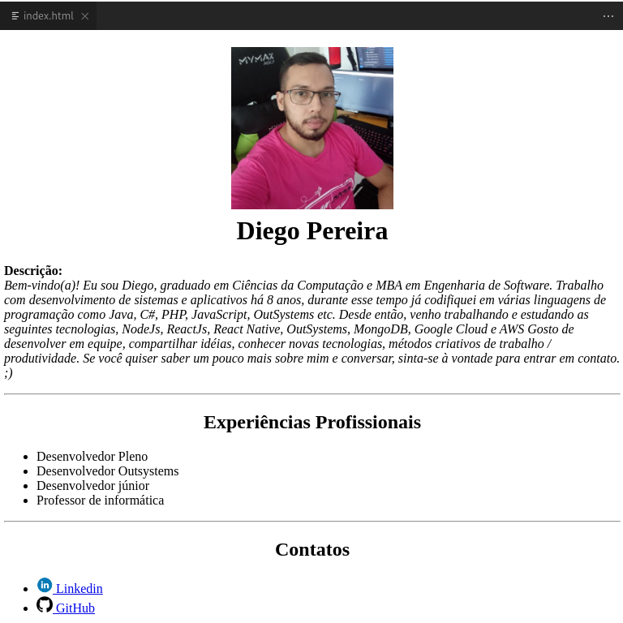

### Front-End - HTML

<details>
<summary>1 - HTML</summary>

> HTML é uma das linguagens que utilizamos para desenvolver websites. O acrônimo HTML vem do inglês e significa Hypertext Markup Language ou em português Linguagem de Marcação de Hipertexto.

> O HTML é a liguagem base da internet. Foi criada para ser de fácil entendimento por seres humanos e também por máquinas, como por exemplo o Google ou outros sistemas que percorrem a internet capturando informação.
</details>

<details>
<summary>2 - Elementos HTML</summary>

- Um elemento é um componente que compõe o HTML. 
- Os elementos são compostos por tags. 
- Existem vários elementos, iremos ver adiante.

EX: 
```html
<elemento> <!-- Abertura do elemento -->
    conteúdo  <!--Conteúdo exibido pelo navegador-->
</elemento> <!-- Fechamento do elemento -->
```

- Alguns elementos:

  - `<p>`: Parágrafo
  - `<h1>`: Título
  - ``: Imagem
  - `<a>`: Link
  - `<ul>`: Lista não ordenada
  - `<ol>`: Lista ordenada
  - `button`: Botão


EX da tag `<p>`:
```html
<p>
    Conteúdo do parágrafo
</p>
```

EX da tag `<h1>`:
```html
<h1>
    Conteúdo do título
</h1>
```

EX da tag ``:
```html

```

EX da tag `<a>`:
```html
<a href="https://www.google.com">
    Link para o Google
</a>
```

EX da tag `<ul>`:
```html
<ul>
    <li>Item 1</li>
    <li>Item 2</li>
    <li>Item 3</li>
</ul>
```

EX da tag `<ol>`:
```html
<ol>
    <li>Item 1</li>
    <li>Item 2</li>
    <li>Item 3</li>
</ol>
```

EX da tag `<button>`:
```html
<button>
    Clique aqui!
</button>
``` 
</details>

<details>
<summary>3 - Atributos</summary>

- Atributos são propriedades que podem ser adicionadas aos elementos.
- Existem vários atributos, iremos ver adiante.

EX da tag `<a>`:
```html
<!-- o href é um atributo que tem o valor do link -->
<a href="https://www.google.com">
    Link para o Google
</a>
```

EX da tag ``:
```html
<!-- o src é um atributo que tem o valor da imagem -->

```

> OBS: cada elemento tem um atributo específico.
</details>

<details>
    <summary>4 - Estrutura básica de uma página HTML</summary>
 
```html
<!DOCTYPE html>
<html>
<head>
<meta charset="UTF-8"/>
<title>Document</title>
</head>
<body>
...
</body>
</html>
```
> O DOCTYPE é usado para definir o tipo de documento que será renderizado. Nesse caso é o HTML versão 5.

> A tag `html` é responsável por definir o início do documento HTML.

> A tag `head` é onde fica localizado o titulo, icone que fica na aba do navegador, codificação dos caracteres, importação de arquivos CSS/JavaScript e etc.

> A tag `meta` são linhas de código `html` ou `etiquetas` que, entre outras coisas, descrevem o conteúdo do seu site para os buscadores. É nelas que você vai inserir as palavras-chave que facilitarão a vida do usuário na hora de te encontrar, por exemplo. 

> A tag `title` é utilizada para definir o título da página que é exibido na aba do navegador.

> A tag `body` é o corpo da página. É nela que fica todo o conteúdo que será exibido no navegador.
</details>


<details>
<summary>5 - Página exemplo</summary>

> Para criar uma página html, é necessário criar um arquivo e salvar com a extensão html e colocar o código dentro do arquivo.

```html
<!DOCTYPE html>
<html lang="en">

    <head>
        <meta charset="UTF-8">
        <meta http-equiv="X-UA-Compatible" content="IE=edge">
        <meta name="viewport" content="width=device-width, initial-scale=1.0">
        <title>Meu currículo</title>
    </head>

    <body>

        <header>
            <h1 align="center">
                
                <br />
                Diego Pereira
            </h1>
            <p>
                <b>Descrição:</b>
                <br />
                <i>
                    Bem-vindo(a)!

                    Eu sou Diego, graduado em Ciências da Computação e MBA em Engenharia de Software.

                    Trabalho com desenvolvimento de sistemas e aplicativos há 8 anos, durante esse tempo já codifiquei
                    em várias linguagens
                    de programação como Java, C#, PHP, JavaScript, OutSystems etc.

                    Desde então, venho trabalhando e estudando as seguintes tecnologias, NodeJs, ReactJs, React Native,
                    OutSystems, MongoDB,
                    Google Cloud e AWS

                    Gosto de desenvolver em equipe, compartilhar idéias, conhecer novas tecnologias, métodos criativos
                    de trabalho /
                    produtividade.

                    Se você quiser saber um pouco mais sobre mim e conversar, sinta-se à vontade para entrar em contato.
                    ;)
                </i>
            </p>
        </header>

        <hr>

        <main>
            <section>
                <h2 align="center">Experiências Profissionais</h2>
                <ul>
                    <li>Desenvolvedor Pleno</li>
                    <li>Desenvolvedor Outsystems</li>
                    <li>Desenvolvedor júnior</li>
                    <li>Professor de informática</li>
                </ul>
            </section>
        </main>

        <hr>

        <footer>
            <section>
                <h2 align="center">Contatos</h2>
                <ul>
                    <li>
                        <a href="https://www.linkedin.com/in/diegopereirati/">
                            
                            Linkedin
                        </a>
                    </li>
                    <li>
                        <a href="https://github.com/dhiegopereira">
                            
                            GitHub
                        </a>
                    </li>
                </ul>
            </section>
        </footer>
    </body>
</html>

```

> Navegador:



###### tags: `internet` `navegação`